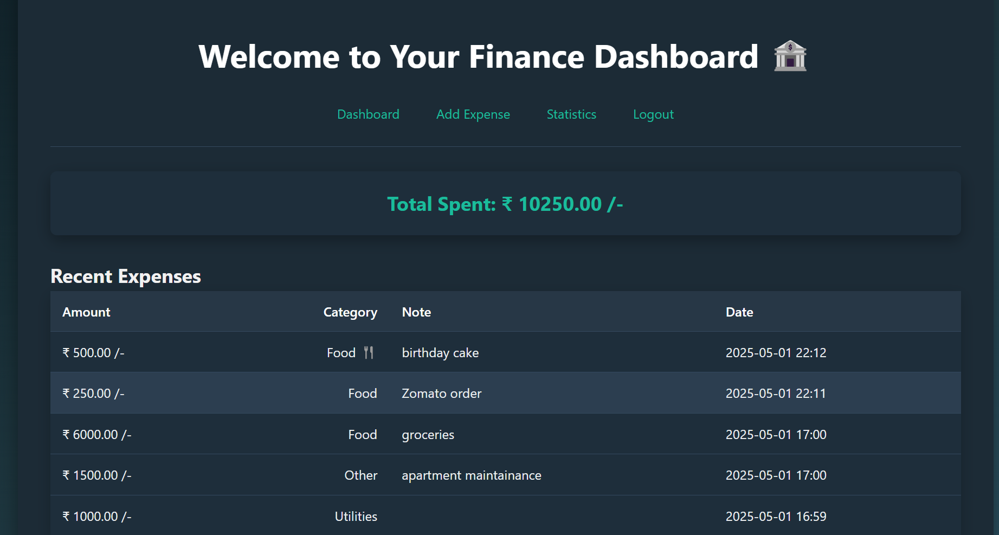

# 💰 CashFlow Commander - Personal Finance Tracker

CashFlow Commander is your streamlined solution for mastering personal finance. Designed with both functionality and user experience in mind, this modern finance tracker empowers you to take full control of your money—without the clutter. Easily track your expenses, manage your investment portfolio, uncover meaningful insights through smart analytics, and securely manage your financial data—all from a sleek, mobile-responsive interface. Whether you're budgeting on the go, reviewing your yearly trends, or monitoring your investments, CashFlow Commander keeps you in command. This App is deployed using Railway...

## 🚀 Deployed Application
[Click here to view the live app!](https://vishnus-cashflow-commander.up.railway.app/)

  
*A modern, intuitive way to track your finances and investments*

## 🌟 Key Features
| Feature | Description |
|---------|-------------|
| 📊 Expense Tracking | Categorize spending with custom notes |
| 📈 Investment Portfolio | Track mutual funds, stocks, FDs, RDs, and more |
| 🔐 Secure Auth | Password hashing & session management |
| 📊 Data Visualization | Daily/monthly/yearly spending analytics |
| 💰 Portfolio Summary | Total investment value and category breakdown |
| 💻 Responsive UI | Works flawlessly on all devices |
| 🐘 PostgreSQL | Relational database for secure data storage |

## 🛠 Tech Stack

**Frontend**:
- HTML5, CSS3 (with Flexbox/Grid)
- Jinja2 Templating
- Vanilla JavaScript (minimal)

**Backend**:
- Python 3.9+
- Flask (Web Framework)
- PostgreSQL (Database)
- psycopg2 (Database Adapter)

**Infrastructure**:
- Railway ready
- Gunicorn (Production WSGI Server)
- dotenv (Environment Management)

## 📦 Installation

1. **Clone the repository**:
   ```bash
   git clone https://github.com/yourusername/cashflow-commander.git
   cd cashflow-commander

# Create virtual environment
python -m venv venv
source venv/bin/activate  # Linux/Mac
.\venv\Scripts\activate   # Windows

# Install dependencies
pip install -r requirements.txt

# Set up environment
cp .env.example .env
nano .env  # Update with your credentials

## Running the App

### 🛠️ Initialize database
```bash
python -c "from app import init_db; init_db()"
'''

### Development

flask run --debug
export FLASK_APP=app.py
python app.py